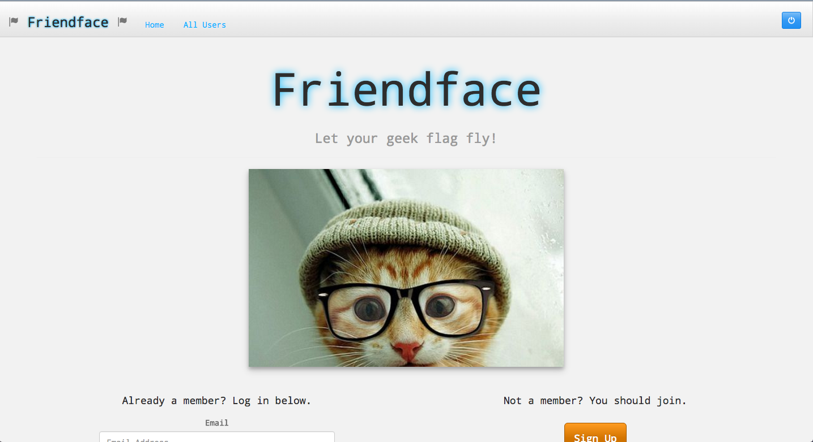

# Friendface

Named in honor of the social network on The IT Crowd, this is the first of two group projects completed at Galvanize. Built with 3 other engineers, this is an incomplete app that was as much about learning how teamwork goes when building apps as it was about building the app itself.

The app is planned to be a social network for connecting geek mentors with baby geeks. The hope is that geeks can both teach and learn from one another, as we often do on StackOverflow, but with the added benefits of a funnier name and emphasis on social interactions.

